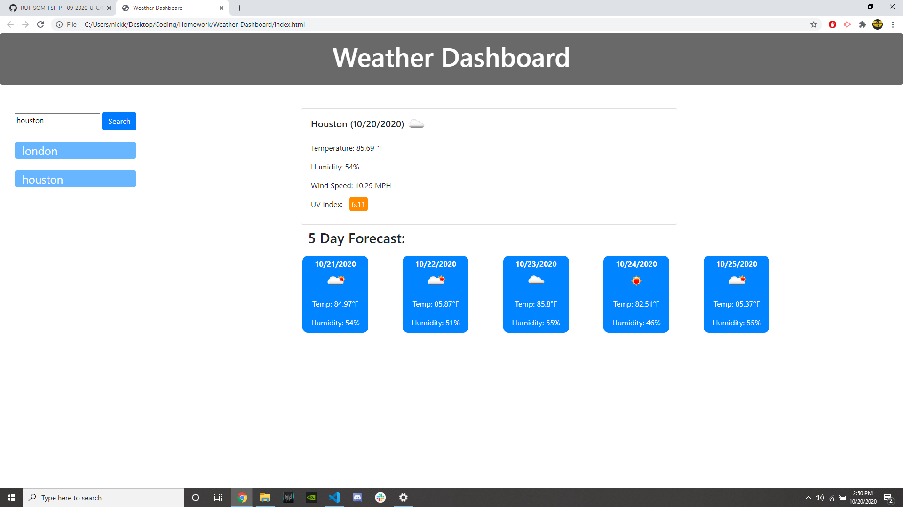

# Weather-Dashboard

https://nickkdb.github.io/Weather-Dashboard/

This project features JavaScript, HTML, and CSS.

HTML/CSS: My HTML utilizes boostrap's library for many of the elements on the page. The heading is a bootstrap jumbotron, and the sections below are positioned using bootstrap's grid layout. The content on the page is held in one large row, where the searchbar and previous searches are held in a small column to the left and the rest is in a larger column on the right. The current day weather and five day forecast are split into subrows, and the five days are sectioned off into five subcolumns. The CSS is static throughout the whole page except for the UV index, where 3 classes are given different stylings and set to the UV based on its severity. 

JS: The javascript starts by looking for previous searches in local storage, and displaying them if they exist. If so the most recent search is displayed to the user. When the user clicks the "search" button, or clicks on a saved search, the startSearch function is called, which makes the ajax calls, then calls 4 more functions once complete. The first two functions are used to display the current weather info of the entered city (one function for each of the two necessary callbacks). The third loops through the five day forecast data to display the necessary info from each day. The last function checks if the entered city is already in the array of saved searches, and if not adds it into the array. 

